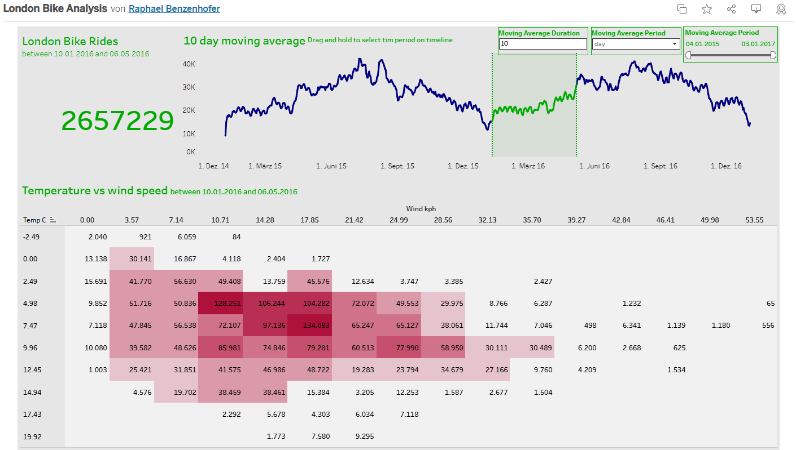

# London Bikes Data Analysis 

## Project Overview
Comprehensive analysis of London bike sharing data using Python for data cleaning/analysis and Tableau for interactive visualization.

## Key Insights
- Analysis of bike usage patterns across different weather conditions
- Seasonal trends in bike sharing demand
- Impact of temperature and humidity on cycling behavior

## Technologies Used
- **Python**: Data cleaning and preprocessing
  - Pandas for data manipulation
  - Seaborn for basic visualizations
- **Tableau Public**: Interactive dashboard creation
- **Kaggle**: Data source

## Project Files
- `main.py` - Python script for data cleaning and preprocessing
- `london_merged.csv` - Raw dataset from Kaggle
- `london_bikes_final.xlsx` - Cleaned and processed data
- `requirements.txt` - Python dependencies

## Tableau Dashboard
**[View Interactive Dashboard on Tableau Public](https://public.tableau.com/shared/KW2WYGXGX?:display_count=n&:origin=viz_share_link)**



## How to Run
1. Clone the repository
```bash
 git clone https://github.com/rbenzenhoefer/london-bikes-analysis-with-tableau-dashboard.git
````
2. Navigate to project directory
```bash
cd london-bikes-analysis-with-tableau-dashboard
```
3. Create virtual environment
```bash
python -m venv venv
   venv\Scripts\activate  # Windows
   source venv/bin/activate  # Mac/Linux
```
4. Install dependencies
```bash
pip install -r requirements.txt
```
5. Run the analysis
```bash
python main.py
```
## Data Source
Dataset from Kaggle - London Bike Sharing Dataset

## Analysis Highlights
- Data preprocessing and cleaning of raw bike sharing data
- Weather impact analysis on bike usage patterns
- Temporal analysis showing peak usage times and seasonal trends
- Interactive visualizations for exploratory data analysis

## Future Enhancements
- Add predictive modeling for bike demand forecasting
- Expand analysis to compare with other cities

## Author
Raphael Benzenhöfer
